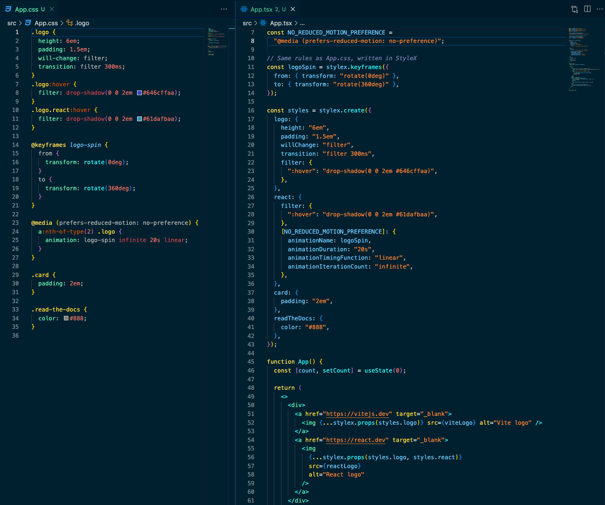

# StyleX demo

---

# References

---

[StyleX](https://stylexjs.com/docs/learn/)

[React + StyleX + Vite + NPM](https://medium.com/@huseyinsalmansoftdev/react-stylex-vite-npm-db9be1e5c5c6)

[How to style body in StyleX?](https://stackoverflow.com/questions/77874749/how-to-style-body-in-stylex)

# What is StyleX?

---

> StyleX is a CSS in JS library, created by Meta, used for in their applications (Facebook, Instagram, WhatsApp etc). It is a JavaScript syntax and compiler for styling web apps. It works best with React, but is also compatible with other frameworks.
> 

## Core principles

- **Co-location**
    
    > Meta does not believe in DRY code for authoring styles. They prefer writing styles in the same file as the markup
    > 
- **Deterministic resolution**
    
    > StyleX is aiming to avoid conflicts and fragile behaviour of CSS coming from specificity.
    > 
- **Type-Safe styles**
    
    > Styles are usually untyped and unreliable, they are often just strings. StyleX is authored with strong static types.
    > 
    
    ```tsx
    // Example 1: Only accepts color and backgroundColor styles
    import type {StyleXStyles} from '@stylexjs/stylex';
    
    type Props = {
      //...
      style?: StyleXStyles<{color?: string; backgroundColor?: string}>;
      //...
    };
    
    // Example 2: Accepts all styles, except margins
    import type {StyleXStylesWithout} from '@stylexjs/stylex';
    
    type Props = {
      //...
      style?: StyleXStylesWithout<{
        margin: unknown;
        marginBlock: unknown;
        marginInline: unknown;
        marginTop: unknown;
        marginBottom: unknown;
        marginLeft: unknown;
        marginRight: unknown;
        marginBlockStart: unknown;
        marginBlockEnd: unknown;
        marginInlineStart: unknown;
        marginInlineEnd: unknown;
      }>;
      //...
    };
    ```
    

# API

---

## Defining styles

- Creating styles
    
    ```tsx
    import * as stylex from '@stylexjs/stylex';
    
    const styles = stylex.create({
      base: {
        fontSize: 16,
        lineHeight: 1.5,
        color: 'rgb(60,60,60)',
      },
      highlighted: {
        color: 'rebeccapurple',
      }, 
    });
    ```
    
- Pseudo-classes
    
    ```tsx
    import * as stylex from '@stylexjs/stylex';
    
    const styles = stylex.create({
      button: {
        backgroundColor: {
          default: 'lightblue',
          ':hover': 'blue',
          ':active': 'darkblue',
        },
      },
    });
    ```
    
- Pseudo-elements
    
    ```tsx
    import * as stylex from '@stylexjs/stylex';
    
    const styles = stylex.create({
      input: {
        // pseudo-element
        '::placeholder': {
          color: '#999',
        },
        color: {
          default: '#333',
          // pseudo-class
          ':invalid': 'red',
        },
      },
    });
    ```
    
- Media queries and other “@ rules”
    
    ```tsx
    import * as stylex from '@stylexjs/stylex';
    
    const styles = stylex.create({
      base: {
        width: {
          default: 800,
          '@media (max-width: 800px)': '100%',
          '@media (min-width: 1540px)': 1366,
        },
      },
    });
    ```
    
- Combining conditions
    
    ```tsx
    import * as stylex from '@stylexjs/stylex';
    
    const styles = stylex.create({
      button: {
        color: {
          default: 'var(--blue-link)',
          ':hover': {
            default: null,
            '@media (hover: hover)': 'scale(1.1)',
          },
          ':active': 'scale(0.9)',
        },
      },
    });
    ```
    
- Fallback styles
    
    ```tsx
    // In CSS:
    // .header {
    //  position: fixed;
    //  position: -webkit-sticky;
    //  position: sticky;
    // }
    
    import * as stylex from '@stylexjs/stylex';
    
    const styles = stylex.create({
      header: {
        position: stylex.firstThatWorks('sticky', '-webkit-sticky', 'fixed'),
      },
    });
    ```
    
- Keyframe animations
    
    ```tsx
    import * as stylex from '@stylexjs/stylex';
    
    const fadeIn = stylex.keyframes({
      from: {opacity: 0},
      to: {opacity: 1},
    });
    
    const styles = stylex.create({
      base: {
        animationName: fadeIn,
        animationDuration: '1s',
      },
    });
    ```
    
- Dynamic styles
    
    ```tsx
    import * as stylex from '@stylexjs/stylex';
    
    const styles = stylex.create({
      // Function arguments must be simple identifiers
      // -- No destructuring or default values
      bar: (height) => ({
        height,
        // The function body must be an object literal
        // -- { return {} } is not allowed
      }),
    });
    
    function MyComponent() {
      // The value of `height` cannot be known at compile time.
      const [height, setHeight] = useState(10);
    
      return <div {...stylex.props(styles.bar(height))} />;
    }
    ```
    

## Using styles

- Basic usage
    
    ```tsx
    <div {...stylex.props(styles.base)} />
    ```
    
- Merging styles
    
    ```tsx
    import * as stylex from '@stylexjs/stylex';
    
    const styles = stylex.create({
      base: {
        fontSize: 16,
        lineHeight: 1.5,
        color: 'grey',
      },
      highlighted: {
        color: 'rebeccapurple',
      },
    });
    
    <div {...stylex.props(styles.base, styles.highlighted)} />;
    ```
    
- Conditional styles
    
    ```tsx
    <div
      {...stylex.props(
        styles.base,
        props.isHighlighted && styles.highlighted,
        isActive ? styles.active : styles.inactive,
      )}
    />
    ```
    
- Style variants
    
    ```tsx
    import * as stylex from '@stylexjs/stylex';
    
    const styles = stylex.create({
      violet: {
        backgroundColor: {
          default: 'blueviolet',
          ':hover': 'darkviolet',
        },
        color: 'white',
      },
      gray: {
        backgroundColor: {
          default: 'gainsboro',
          ':hover': 'lightgray',
        },
      },
      // ... more variants here ...
    });
    
    function Button({variant, ...props}) {
      return <button {...props} {...stylex.props(styles[variant])} />;
    }
    ```
    
- Style as props
    
    ```tsx
    // This is incorrect syntax, and must not be used!
    // <CustomComponent style={stylex.props(styles.base)} />
    
    <CustomComponent style={styles.base} />
    
    // Multiple style object
    <CustomComponent style={[styles.base, isHighlighted && styles.highlighted]} />
    ```
    
- Accepting styles in components
    
    ```tsx
    // Styles passed in as props are applied after local styles.
    // This makes design system components predictable to use,
    // and easy to customize.
    
    import * as stylex from '@stylexjs/stylex';
    
    // Local Styles
    const styles = stylex.create({
      base: {
        /*...*/
      },
    });
    
    function CustomComponent({style}) {
      return <div {...stylex.props(styles.base, style)} />;
    }
    ```
    
- Unsetting styles
    
    ```tsx
    // Setting a style property to null removes any previously applied
    // style for it by StyleX.
    
    import * as stylex from '@stylexjs/stylex';
    
    const styles = stylex.create({
      base: {
        color: null,
      },
    });
    ```
    

## Variables

- **Rules ⚠️**
    
    <aside>
      <ul>
        <li>Variables must be defined in `.stylex.js` files. (.js / .mjs / .cjs / .ts / .tsx / .jsx)</li>
        <li>Variables must be named exports!</li>
        <li>Variables must be imported directly from the `.stylex.js` files that define them.</li>
      </ul>
    </aside>
    
- Defining variables
    
    ```tsx
    import * as stylex from '@stylexjs/stylex';
    
    export const tokens = stylex.defineVars({
      primaryText: 'black',
      secondaryText: '#333',
      accent: 'blue',
      background: 'white',
      lineColor: 'gray',
      borderRadius: '4px',
      fontFamily: 'system-ui, sans-serif',
      fontSize: '16px',
    });
    ```
    
- Using media queries
    
    ```tsx
    import * as stylex from '@stylexjs/stylex';
    
    // A constant can be used to avoid repeating the media query
    const DARK = '@media (prefers-color-scheme: dark)';
    
    export const colors = stylex.defineVars({
      primaryText: {default: 'black', [DARK]: 'white'},
      secondaryText: {default: '#333', [DARK]: '#ccc'},
      accent: {default: 'blue', [DARK]: 'lightblue'},
      background: {default: 'white', [DARK]: 'black'},
      lineColor: {default: 'gray', [DARK]: 'lightgray'},
    });
    ```
    
- Using variables
    
    ```tsx
    import * as stylex from '@stylexjs/stylex';
    
    // A constant can be used to avoid repeating the media query
    const DARK = '@media (prefers-color-scheme: dark)';
    
    export const colors = stylex.defineVars({
      primaryText: {default: 'black', [DARK]: 'white'},
      secondaryText: {default: '#333', [DARK]: '#ccc'},
      accent: {default: 'blue', [DARK]: 'lightblue'},
      background: {default: 'white', [DARK]: 'black'},
      lineColor: {default: 'gray', [DARK]: 'lightgray'},
    });
    
    export const spacing = stylex.defineVars({
      none: '0px',
      xsmall: '4px',
      small: '8px',
      medium: '12px',
      large: '20px',
      xlarge: '32px',
      xxlarge: '48px',
      xxxlarge: '96px',
    });
    ```
    
    ```tsx
    import * as stylex from '@stylexjs/stylex';
    import {colors, spacing} from '../tokens.stylex';
    
    const styles = stylex.create({
      container: {
        color: colors.primaryText,
        backgroundColor: colors.background,
        padding: spacing.medium,
      },
    });
    ```
    

## Themes

- **Rules 🎨**
    
    <aside>
      <ul>
        <li>Once variables have been defined, alternate “themes” can be created to override the values of those variables for specific UI sub-trees.</li>
      </ul>
    </aside>
    
- Creating themes
    
    ```tsx
    import * as stylex from '@stylexjs/stylex';
    import {colors, spacing} from './tokens.stylex';
    
    // A constant can be used to avoid repeating the media query
    const DARK = '@media (prefers-color-scheme: dark)';
    
    // Dracula theme
    export const dracula = stylex.createTheme(colors, {
      primaryText: {default: 'purple', [DARK]: 'lightpurple'},
      secondaryText: {default: 'pink', [DARK]: 'hotpink'},
      accent: 'red',
      background: {default: '#555', [DARK]: 'black'},
      lineColor: 'red',
    });
    ```
    
- Applying themes
    
    ```tsx
    import * as stylex from '@stylexjs/stylex';
    import {colors, spacing} from '../tokens.styles';
    import {dracula} from '../themes';
    
    const styles = stylex.create({
      container: {
        color: colors.primaryText,
        backgroundColor: colors.background,
        padding: spacing.medium,
      },
    });
    
    <div {...stylex.props(dracula, styles.container)}>{children}</div>;
    ```
    

## Static Types

- Types for style props
    
    ```tsx
    import type {StyleXStyles} from '@stylexjs/stylex';
    import * as stylex from '@stylexjs/stylex';
    
    type Props = {
      ...
      style?: StyleXStyles,
    };
    
    function MyComponent({style, ...otherProps}: Props) {
      return (
        <div
          {...stylex.props(localStyles.foo, localStyles.bar, style)}
        >
          {/* ... */}
        </div>
      );
    }
    ```
    
- Constraining accepted styles
    
    ```tsx
    // Accepting from a set of style properties
    import type {StyleXStyles} from '@stylexjs/stylex';
    
    type Props = {
      // ...
      style?: StyleXStyles<{
        color?: string;
        backgroundColor?: string;
        borderColor?: string;
        borderTopColor?: string;
        borderEndColor?: string;
        borderBottomColor?: string;
        borderStartColor?: string;
      }>;
    };
    
    // Limiting the possible values for styles
    import type {StyleXStyles} from '@stylexjs/stylex';
    
    type Props = {
      ...
      // Only accept styles for marginTop and nothing else.
      // The value for marginTop can only be 0, 4, 8 or 16.
      style?: StyleXStyles<{
        marginTop: 0 | 4 | 8 | 16
      }>,
    };
    ```
    
- Disallowing properties
    
    ```tsx
    import type {StyleXStylesWithout} from '@stylexjs/stylex';
    import * as stylex from '@stylexjs/stylex';
    
    type NoLayout = StyleXStylesWithout<{
      position: unknown,
      display: unknown,
      top: unknown,
      start: unknown,
      end: unknown,
      bottom: unknown,
      border: unknown,
      borderWidth: unknown,
      borderBottomWidth: unknown,
      borderEndWidth: unknown,
      borderStartWidth: unknown,
      borderTopWidth: unknown,
      margin: unknown,
      marginBottom: unknown,
      marginEnd: unknown,
      marginStart: unknown,
      marginTop: unknown,
      padding: unknown,
      paddingBottom: unknown,
      paddingEnd: unknown,
      paddingStart: unknown,
      paddingTop: unknown,
      width: unknown,
      height: unknown,
      flexBasis: unknown,
      overflow: unknown,
      overflowX: unknown,
      overflowY: unknown,
    }>;
    
    type Props = {
      // ...
      style?: NoLayout,
    };
    
    function MyComponent({style, ...}: Props) {
      return (
        <div
          {...stylex.props(localStyles.foo, localStyles.bar, style)}
        >
          {/* ... */}
        </div>
      );
    }
    ```
    

# A simple example for comparison (Vite + React project init screen)

---


